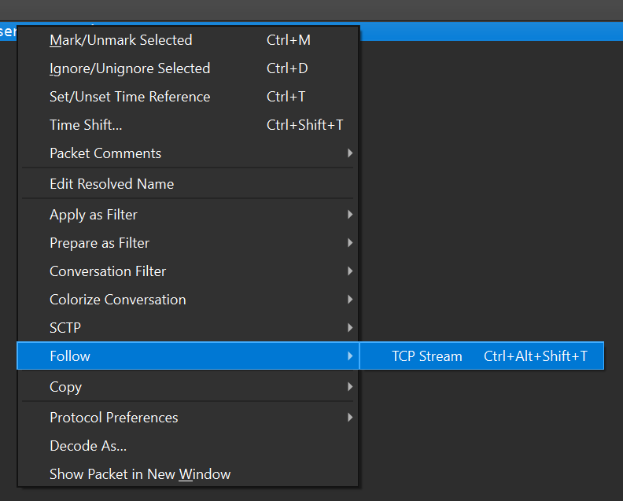

# CREEKCTF 24-25 Wireshark-based Challenges
For CreekCTF 24-25, we had two Wireshark based challenges, I'm getting a headache, and I HATE MY HEADACHE WAAAAAA 1.

## I'm getting a headache
This challenge supplied you with a pcap file called "noise.pcapng". If you open this in [Wireshark](https://www.wireshark.org/), you will see a lot of noise(haha get the filename). 
PCAP files record all the traffic occuring on a network, including connections between computers. From a first glance, we can see a lot of ICMP and ARP requests, then looking more we can see TCP,FTP,MDNS,LLMNR, and NBNS protocols being used.
The challenge description asks for what command an infiltrator used after getting into another computer, from this description we can first look at FTP packets(each line is called a packet) to see what these packets were sent to do.

From here we can apply a [display filter](https://wiki.wireshark.org/DisplayFilters) for ftp packets by entering it into the small searchbar at the top of our screen. 
For now we will just use ` ftp ` to only see packets using the FTP protocol

From here we see a bunch of failed attempts to connect with another computer, while we could go one by one to figure out which packet contains the used command, this gives us a very limited view of what the attacker did and is not a technique that should be relied upon.
Instead we can find a list of codes the FTP protocol will reply with.

[Link to Wikipedia article containing codes](https://en.wikipedia.org/wiki/List_of_FTP_server_return_codes)

From this page we can see that it should start with a 2 for a succesful operation, so we apply a display filter of `ftp contains "2"` to see all the responses with 2 in the response. we still see ~20 packets, so we should refine our search.
While at this point, you can see a packet that has the info "User logged in", I'm going to pretend as if going through each packet individually isn't feasible(let's say we have thousands of succesful ftp requests). 

From here we can refine our search by finding the code for a login request, which is x3x. so our new display filter is `ftp contains "23"` and only one packet is there. But we run into a new problem, how do we find the command the inflitrator used after getting into the system?
We can do this by right clicking on the packet, going down to follow, then clicking on TCP stream
 
From here we get a popup showing the entire conversation between two computers. We can see the login process, username, and password all because ftp is an unencrypted protocol. Lower we find the command as its own line.

## I HATE MY HEADACHE WAAAAAA 1.
Similar to the last challenge we get a PCAP file containing a bunch of network information, but significantly less noisy. If we apply the same strategy as the last challenge and use the display filter `ftp contains "23"` we can see a packet where a succesful login happened.
Examining the conversation through the follow option, we can see that the command `STOR flag.png` was used, however the challenge was asking for whats actually in the file...

Exiting out of the popup window we can see a bunch of packets, but none of them seem to have the actual data of the transferred file... we can see the Source and Destination of the packets, so we can search for other packets matching this by using the display filter `ip.src == 10.10.10.20 && ip.dst == 10.10.10.10`.
This filter shows us all the packets(data) going from the first computer to the second. Here we see a couple new packets that didn't show when following the conversation all under the protocol `FTP-DATA`. All of them have (STOR flag.png) in the description, and are sent right after the command we saw earlier.
We can right click and follow tcp stream to see the full data, then click `Save as...` on the bottom right of the popup. Name the file with a .png extension, then open the file and see the contents to finish this challenge!

Ignore the 1 part lol, I was going to make more but got pre-occupied with other parts of making sure the competition would be enjoyable.
